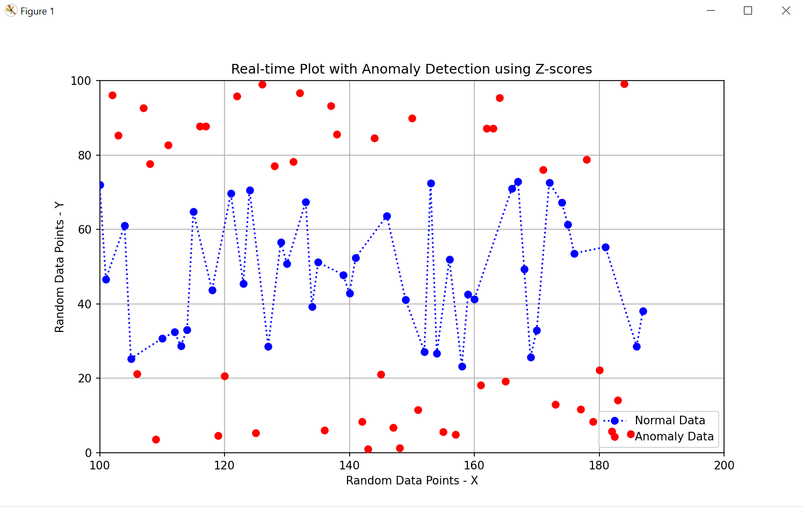

# Anomaly-Detection-Python
## Overview

This Python application generates a real-time plot of random data points and identifies anomalies using z-scores. The plot dynamically updates with new data points, and the x-axis limits adjust to show the most recent 100 data points. Anomalies are highlighted with a '*' marker.

## Theory

Z-score anomaly detection is a statistical method used to identify outliers in a dataset. The z-score measures how many standard deviations a data point is from the mean of the dataset. A data point is considered an anomaly if its z-score is beyond a specified threshold (e.g., greater than 0.9 or less than -0.9). This method helps in detecting data points that significantly deviate from the normal distribution.

### Steps to Calculate Z-Score:
1. Calculate the mean (average) of the dataset.
2. Calculate the standard deviation of the dataset.
3. For each data point, subtract the mean and divide by the standard deviation.
    - Formula: z = (x - μ) / σ
      - where:
         - x = data point
         - μ = mean of the dataset
         - σ = standard deviation of the dataset
4. Compare the z-score to the threshold to determine if the data point is an anomaly.

## Python Code

The main script for this application is `sandaruwan_anomalies_by_z_scores.py`. Below is a brief overview of the code structure:

- Import necessary libraries: `matplotlib`, `numpy`, `matplotlib.animation`
- Create a plot figure and axis
- Initialize lists to store data points and anomalies
- Define functions to generate random data, calculate z-scores, check for anomalies, and update the plot
- Create an animation of the plot that updates in real-time

## How to Run

1. **Install Required Libraries**: Ensure you have the necessary libraries installed. You can install them using pip:
    ```bash
    pip install matplotlib numpy
    ```
2. **Save the Script**: Save the provided Python script as `sandaruwan_anomalies_by_z_scores.py`.
3. **Run the Script**: Execute the script using Python:
    ```bash
    python3 sandaruwan_anomalies_by_z_scores.py
    ```

## Example Output



The plot will display real-time data points with anomalies highlighted in red.

## Additional Information

This application is useful for real-time anomaly detection in streaming data. The z-score method is simple yet effective for identifying outliers in a dataset. Adjust the threshold value to fine-tune the sensitivity of anomaly detection.

For more details, refer to the comments within the Python script.
